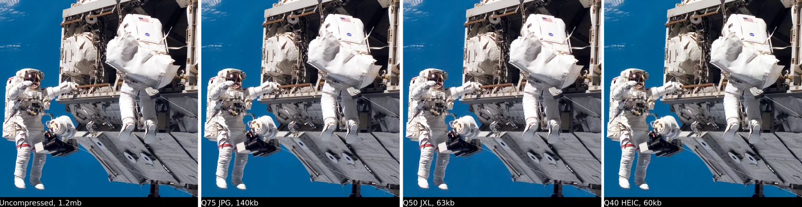

libvips 8.11 is almost now out, so here's a quick overview of what's new. Check
the [ChangeLog](https://github.com/libvips/libvips/blob/master/ChangeLog)
if you need more details.

Credit to Zeranoe, DarthSim, Projkt-James, afontenot, 781545872, erdmann,
kleisauke and others for their great work on this release.

[Lunaphore](https://www.lunaphore.ch/) kindly sponsored the development of
the new JPEG2000 features, see below.

# Experimental JPEG-XL support

We've added perimental support for[JPEG-XL](https://jpeg.org/jpegxl/).
This is a new iteration of the JPEG standard, 
currently in development. The Chrome web browser supports it
behind a flag, and it looks like it might be enabled by default this autumn
in Chrome 89.

There have been several attempts to replace JPEG with something better in the
last few years. HEIC is perhaps the best known: it can compress files to
about half the size of comparable JPEGs and supports a range of useful
features like animations, transparency and lossless
compression. Unfortunately, it has some patent issues which may limit its
usefulness.

AVIF is rather like HEIC, but has no patents attached to it. Sadly the
available load and save libraries are extremely slow.

JPEG-XL looks like it might avoid all these problems: it offers the same great
compression and useful features as HEIC and AVIF, but has no problems with 
patents, and is fast enough for practical use. 

I made a sample image. You'll need to zoom in to check details:



Compression and decompression is quite a bit quicker than HEIC:

```
$ time vips copy astronauts.png x.jxl
real 0m0.218s
user 0m0.291s
sys 0m0.204s

$ time vips copy astronauts.png x.heic
real 0m0.413s
user 0m1.273s
sys 0m0.048s 
```

JPEG-XL is still a little immature, so it's not enabled by default in
libvips 8.11. Hopefully the missing features (metadata, progressive encode
and decode, animation, etc.) will arrive soon, and the remaining bugs will
be squeezed out.

# Thread recycling

We've revamped the libvips threading system.
The new implementation uses a [GLib thread
pool](https://developer.gnome.org/glib/stable/glib-Thread-Pools.html)
to provide a single set of threads for the whole of libvips. This means
threads get reused rather then being constantly created and destroyed.

This was originally intended for WebAssembly but it turned out to be useful
for native environments as well. Relative speed-ups are varying between ~4%
and ~15% compared to the previous implementation. Especially for short-lived
pipelines and long-running processes, a performance improvement can be observed.

# Loadable modules for some dependencies

libvips now supports building OpenSlide, libheif, Poppler and libMagick
as dynamically loadable modules. This makes it easier for distributions to
provide separate (optional) packages for these dependencies, making the core
package much slimmer and thus reducing the attack surface. Distributing
separate packages could also help to comply with GPL licensing (“mere
aggregation” clause) or patent-encumbered software.

[GModule](https://developer.gnome.org/glib/stable/glib-Dynamic-Loading-of-Modules.html)
is used to accomplish this in a portable way. We already had a simple plugin
system based on this, but the build part was not yet implemented.

These loadable modules are built automatically when GModule is supported,
which should be at least Linux, Windows and macOS. It can be disabled by
passing `--disable-modules` while configuring libvips.

# Full-colour text rendering

The libvips `text` operator was designed a while ago, when fonts were still
black and white. It outputs a one-band mask image which you then process with
the other libvips operations to do things like rendering text on an image.

Many fonts, especially emoji fonts, now have full-colour SVG characters.
There's a new `rgba` flag to `text` to enable colour rendering. For example:

```
$ vips text x.png "😀<span foreground='red'>red</span><span background='cyan'>blue</span>" --dpi 300 --rgba
```

Makes this:


You can then use `composite` to render these text RGBA images on to another
image.

# JPEG2000 support

Thanks to generous sponsorship from Lunaphore, we've added support for the
(now rather elderly) JPEG2000 format.

The `jp2kload` and `jp2ksave` operations support all the file format
features: shrink-on-load, 8-, 16- and 32-bit data, any number of
image bands, tiled images, YCC colourspace, lossless compression, and
optional chroma subsampling. The lossy compression profile (controlled
by a `Q` parameter) is derived from the [British Museum's JPEG2000
recommendations](https://purl.pt/24107/1/iPres2013_PDF/An%20Analysis%20of%20Contemporary%20JPEG2000%20Codecs%20for%20Image%20Format%20Migration.pdf).

We've also added support for JPEG2000 as a codec for TIFF load and save. This
means you can now directly load and save some popular slide image formats.
This should be useful for people in the medical imaging community.

It's very easy to use -- for example:

```
$ vips copy k2.jpg x.tif[compression=jp2k,Q=90,tile]
$ vips copy k2.jpg x.tif[compression=jp2k,lossless]
```

# C++ API improments

We've spent some time improving the C++ API. 

We now use [doxygen](https://www.doxygen.nl) to generate C++ API docs
automatically, and we've written a set of API comments. Hopefully the [new
documentation](link-to-cpp-docs) should be a big improvement.

There are a couple of functional improvements too. There's support for
`VipsInterpolate`, `guint64` and a new constructor,
`VImage::new_from_memory_steal`, which can save a copy operation.

# Minor improvements

- The `perlin`, `worley` and `gaussnoise` operators have a new `seed`
  parameter to set the seed for their random number generator.

- The `rank` operator has a new path for large windows on 8-bit images. It can
  be up to 20 times faster in some cases.

- Image histograms on large images now use `double` values. Previously,
  we were limited to images with under 2^32 pixels.

- There's a new `black_point_compensation` for colour operations involving
  ICC profiles, and detection of bad profiles and fallback to default
  profiles is much better.

- The loaders and savers for PDFium, OpenSlide, vips, NIfTI, and FITS have
  been moved to the new libvips IO framework.

- `vipsthumbnail` can now load and save to and from stdin and stdout.

- PNG save selects between 8- and 16-bit output more intelligently, and
  supports background colour as metadata.

- We've switched GIF load to the excellent libnsgif library, and libvips
  embeds the library code.

- `tiffsave` can write premultipled alpha.

- PDFium support has been revised. It should now build very simply, and ought
  to be much faster in threaded applications.

- We've fixed a range of reference leaks in the mosaicing package, and we
  now run the leak checker as part of CI.

As usual,
the [ChangeLog](https://github.com/libvips/libvips/blob/master/ChangeLog)
has more details, if you're interested.

